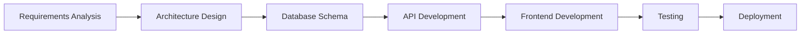

# OneClass AI Agent Development Workflow System

## 🎯 Agent Orchestra Architecture

### Master Coordination Layer

```yaml
MASTER_COORDINATOR:
  name: "Maestro-OneClass"
  role: "Chief Orchestration Officer"
  responsibilities:
    - Sprint planning and module prioritization
    - Cross-agent dependency management
    - Quality gate enforcement
    - Risk assessment and mitigation
    - Progress tracking and reporting
```

## 🤖 Specialized AI Agents Roster

### 1. Architecture & Planning Agents

#### Agent-Architect
```yaml
name: "Claude-Architect"
domain: "System Architecture & Design"
responsibilities:
  - Module architecture design
  - API contract definitions
  - Database schema design
  - Integration patterns
  - Performance requirements
handoffs_to: ["Claude-DB", "Claude-Backend", "Claude-Frontend"]
```

#### Agent-Requirements
```yaml
name: "Claude-Requirements"
domain: "Requirements Engineering"
responsibilities:
  - User story creation
  - Acceptance criteria definition
  - Module dependency mapping
  - Compliance requirements (ZIMSEC, Ministry)
handoffs_to: ["Claude-Architect", "Claude-UX"]
```

### 2. Database & Data Layer Agents

#### Agent-Database
```yaml
name: "Claude-DB"
domain: "Database Architecture"
responsibilities:
  - PostgreSQL schema creation
  - Migration scripts
  - Index optimization
  - Data integrity rules
  - Backup strategies
handoffs_to: ["Claude-Backend", "Claude-Test-DB"]
```

#### Agent-DataSync
```yaml
name: "Claude-DataSync"
domain: "Offline/Online Synchronization"
responsibilities:
  - Sync queue architecture
  - Conflict resolution strategies
  - IndexedDB schemas
  - Delta sync algorithms
handoffs_to: ["Claude-Backend", "Claude-Mobile"]
```

### 3. Backend Development Agents

#### Agent-Backend
```yaml
name: "Claude-Backend"
domain: "API & Business Logic"
responsibilities:
  - RESTful API development
  - Business logic implementation
  - Authentication/authorization
  - Payment integration (Paynow, EcoCash)
  - ZIMSEC API integration
handoffs_to: ["Claude-Frontend", "Claude-Mobile", "Claude-Test-API"]
```

#### Agent-Microservices
```yaml
name: "Claude-Microservices"
domain: "Service Architecture"
responsibilities:
  - Service decomposition
  - Message queue setup
  - Event-driven architecture
  - Service mesh configuration
handoffs_to: ["Claude-Backend", "Claude-DevOps"]
```

### 4. Frontend Development Agents

#### Agent-Frontend
```yaml
name: "Claude-Frontend"
domain: "React Web Application"
responsibilities:
  - React component development
  - TailwindCSS styling
  - ShadCN UI implementation
  - State management (Redux/Zustand)
  - Progressive Web App features
handoffs_to: ["Claude-UX", "Claude-Test-UI"]
```

#### Agent-Mobile
```yaml
name: "Claude-Mobile"
domain: "Flutter Mobile Apps"
responsibilities:
  - Flutter app development
  - Offline-first implementation
  - Native feature integration
  - Push notifications
handoffs_to: ["Claude-UX", "Claude-Test-Mobile"]
```

### 5. UX/UI Design Agents

#### Agent-UX
```yaml
name: "Claude-UX"
domain: "User Experience Design"
responsibilities:
  - User journey mapping
  - Wireframe creation
  - Interaction design
  - Accessibility standards
  - Multi-language support (English/Shona/Ndebele)
handoffs_to: ["Claude-Frontend", "Claude-Mobile"]
```

### 6. Quality Assurance Agents

#### Agent-TestAPI
```yaml
name: "Claude-Test-API"
domain: "API Testing"
responsibilities:
  - API test automation
  - Load testing
  - Integration testing
  - Contract testing
handoffs_to: ["Claude-Performance", "Claude-Security"]
```

#### Agent-TestUI
```yaml
name: "Claude-Test-UI"
domain: "UI Testing"
responsibilities:
  - E2E test automation (Cypress/Playwright)
  - Cross-browser testing
  - Visual regression testing
  - Accessibility testing
handoffs_to: ["Claude-Performance"]
```

### 7. Infrastructure & DevOps Agents

#### Agent-DevOps
```yaml
name: "Claude-DevOps"
domain: "Infrastructure & Deployment"
responsibilities:
  - Docker containerization
  - CI/CD pipeline setup
  - Kubernetes orchestration
  - Infrastructure as Code
  - Monitoring setup
handoffs_to: ["Claude-Security", "Claude-Performance"]
```

#### Agent-Cloud
```yaml
name: "Claude-Cloud"
domain: "Cloud Architecture"
responsibilities:
  - AWS/GCP resource provisioning
  - CDN configuration
  - Auto-scaling policies
  - Disaster recovery
handoffs_to: ["Claude-DevOps", "Claude-Security"]
```

### 8. Specialized Domain Agents

#### Agent-Education
```yaml
name: "Claude-Education"
domain: "Zimbabwe Education System"
responsibilities:
  - ZIMSEC compliance
  - Curriculum mapping
  - Report card templates
  - Three-term system logic
handoffs_to: ["Claude-Backend", "Claude-Frontend"]
```

#### Agent-Finance
```yaml
name: "Claude-Finance"
domain: "School Finance Systems"
responsibilities:
  - Fee structure logic
  - Payment gateway integration
  - Financial reporting
  - Arrears management
handoffs_to: ["Claude-Backend", "Claude-Security"]
```

## 📋 Module Development Workflow

### Phase 1: Core Academic Foundation Sprint



#### Week 1-2: Student Information System (SIS)
```yaml
Day 1-2:
  Claude-Requirements:
    - Analyze SIS requirements
    - Create user stories for profiles, enrollment, medical records
    - Define ZIMSEC integration points
    
  Claude-Architect:
    - Design SIS module architecture
    - Define API contracts
    - Create data flow diagrams

Day 3-4:
  Claude-DB:
    - Create students table schema
    - Design family_relationships table
    - Set up medical_records structure
    - Create enrollment_history tracking
    
  Claude-Backend:
    - Implement Student CRUD APIs
    - Build enrollment workflow
    - Create family linking logic

Day 5-7:
  Claude-Frontend:
    - Build student profile components
    - Create enrollment forms
    - Implement search/filter UI
    
  Claude-Mobile:
    - Develop offline student data cache
    - Build parent view screens

Day 8-9:
  Claude-Test-API:
    - Test all SIS endpoints
    - Validate data integrity
    
  Claude-Test-UI:
    - E2E testing of enrollment flow
    - Cross-device testing

Day 10:
  Claude-DevOps:
    - Deploy SIS module
    - Configure monitoring
```

### Automated Coordination Protocol

```python
# Daily Standup Automation
def daily_coordination():
    """
    Executed at 6 AM CAT daily
    """
    
    # 1. Collect status from all agents
    status_reports = []
    for agent in active_agents:
        status = agent.get_progress_report()
        blockers = agent.identify_blockers()
        status_reports.append({
            'agent': agent.name,
            'progress': status,
            'blockers': blockers
        })
    
    # 2. Identify cross-agent dependencies
    dependencies = analyze_dependencies(status_reports)
    
    # 3. Resolve blockers
    for blocker in get_all_blockers(status_reports):
        resolution = find_resolution_agent(blocker)
        assign_priority_task(resolution['agent'], blocker)
    
    # 4. Assign today's tasks
    for agent in active_agents:
        tasks = calculate_optimal_tasks(agent, dependencies)
        agent.assign_tasks(tasks)
    
    # 5. Update dashboard
    update_progress_dashboard(status_reports)
    
    return coordination_summary
```

### Handoff Protocol

```yaml
handoff_template:
  from_agent: "Claude-Backend"
  to_agent: "Claude-Frontend"
  module: "SIS"
  deliverables:
    - api_documentation: "swagger.json"
    - endpoints_ready:
        - "GET /api/students"
        - "POST /api/students"
        - "PUT /api/students/{id}"
    - sample_responses: "sample_data.json"
    - authentication_requirements: "JWT with roles"
  validation_checklist:
    - All CRUD operations tested
    - Error handling implemented
    - Rate limiting configured
    - Documentation complete
  next_actions:
    - Implement student list component
    - Create student detail view
    - Add search/filter functionality
```

## 🔄 Quality Gates

### Module Completion Criteria

```yaml
quality_gates:
  code_quality:
    - Test coverage > 80%
    - No critical security vulnerabilities
    - Performance benchmarks met
    - Code review approved
    
  documentation:
    - API documentation complete
    - User guides written
    - Deployment guide updated
    - Architecture decision records
    
  integration:
    - All APIs integrated
    - Data sync verified
    - Cross-module testing passed
    - Rollback plan tested
    
  compliance:
    - ZIMSEC requirements met
    - Data privacy compliant
    - Accessibility standards passed
    - Multi-language support verified
```

## 📊 Progress Tracking Dashboard

```yaml
dashboard_metrics:
  module_progress:
    - Modules completed: 4/39
    - Current sprint: Phase 1 - Core Academic
    - Sprint velocity: 2 modules/week
    
  agent_performance:
    - Tasks completed today: 47
    - Blockers resolved: 12
    - Code commits: 156
    - Tests passed: 98.3%
    
  quality_metrics:
    - Code coverage: 82%
    - Bug density: 0.3/KLOC
    - Performance score: 94/100
    - Security score: A+
    
  timeline:
    - Phase 1 completion: 3 weeks
    - MVP delivery: 8 weeks
    - Full platform: 20 weeks
```

## 🚀 Execution Commands

### Initialize Development Environment
```bash
# Setup all agents
./scripts/init-agents.sh --platform oneclass

# Configure agent permissions
./scripts/configure-permissions.sh --config config/agents.yaml

# Start coordination daemon
./scripts/start-coordinator.sh --mode development
```

### Daily Operations
```bash
# Morning standup (6 AM CAT)
python scripts/ai-agents/daily-standup.py --project oneclass

# Assign sprint tasks
python scripts/ai-agents/assign-sprint-tasks.py --sprint 1 --phase core-academic

# Monitor progress
python scripts/ai-agents/monitor-progress.py --real-time

# Generate reports
python scripts/ai-agents/generate-reports.py --type daily --format pdf
```

### Module Development
```bash
# Start new module
python scripts/ai-agents/start-module.py --name "Finance & Billing"

# Run quality checks
python scripts/ai-agents/quality-check.py --module finance --strict

# Deploy module
python scripts/ai-agents/deploy-module.py --module finance --env staging
```

## 🎯 Success Metrics

```yaml
project_kpis:
  development_efficiency:
    - Module completion rate: 2 per week
    - First-time quality rate: > 90%
    - Agent collaboration score: > 95%
    
  technical_excellence:
    - System uptime: 99.9%
    - Response time: < 200ms
    - Offline sync success: > 98%
    
  business_impact:
    - Schools onboarded: 50 in pilot
    - User satisfaction: > 4.5/5
    - Ministry compliance: 100%
```

## 🔒 Risk Management

```yaml
risk_mitigation:
  technical_risks:
    - risk: "Offline sync conflicts"
      mitigation: "Dedicated Claude-DataSync agent with conflict resolution"
      
    - risk: "ZIMSEC API changes"
      mitigation: "Abstraction layer with versioning"
      
  operational_risks:
    - risk: "Agent coordination failure"
      mitigation: "Fallback to manual coordination with alerts"
      
    - risk: "Quality degradation"
      mitigation: "Automated quality gates at each handoff"
```

## 📈 Scaling Strategy

As the platform grows, the agent system scales by:

1. **Agent Specialization**: Creating sub-agents for complex modules
2. **Parallel Execution**: Running multiple agent teams on different modules
3. **Learning Integration**: Agents learn from previous sprints to improve
4. **Automated Testing**: Expanding test coverage with specialized test agents

This orchestrated approach ensures consistent quality, rapid development, and seamless integration across all 39 modules of the OneClass platform.