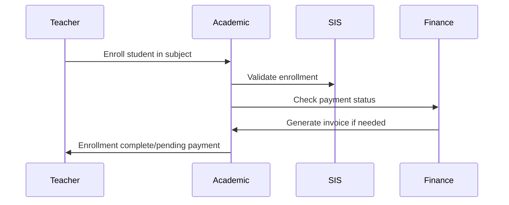
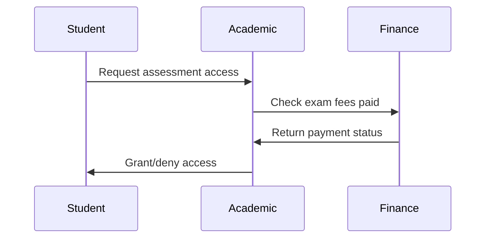
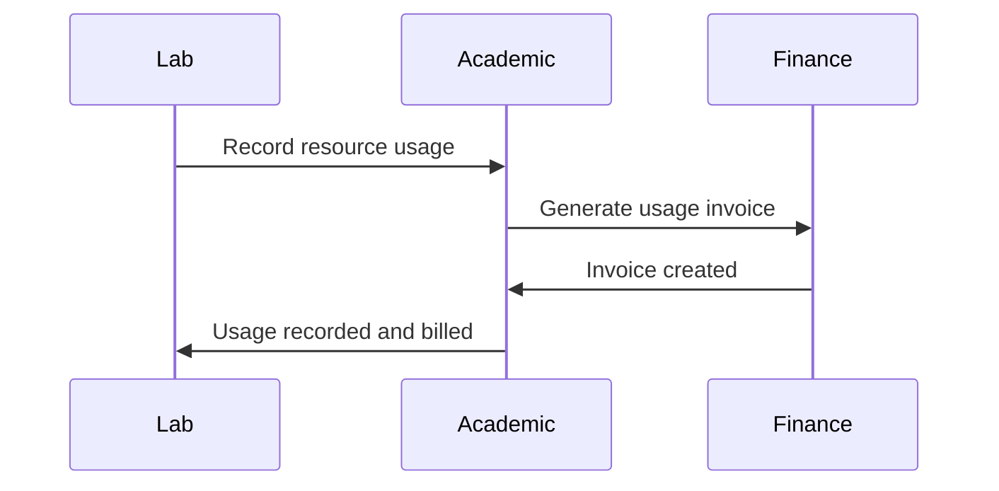

# Academic Management Integration Summary

## Overview

This document summarizes the comprehensive integration between the Academic Management module and the existing SIS (Student Information System) and Finance & Billing modules in the OneClass Platform. The integration provides seamless data flow and cross-module functionality while maintaining Zimbabwe-specific features.

## Integration Architecture

### 1. **Academic-SIS Integration**
- **Purpose**: Bridge student data between SIS and Academic Management
- **Key Features**: Student enrollment validation, class management, guardian notifications
- **Data Flow**: SIS → Academic Management for student/class data

### 2. **Academic-Finance Integration**
- **Purpose**: Fee-based access control and automatic billing for academic activities
- **Key Features**: Payment-based subject access, resource usage billing, financial reporting
- **Data Flow**: Academic Management ↔ Finance for access control and billing

### 3. **Cross-Module Validation**
- **Purpose**: Ensure data consistency across all modules
- **Key Features**: Enrollment validation, payment status checks, access control
- **Data Flow**: Bidirectional validation between all modules

## Implementation Details

### Backend Integration Services

#### 1. **AcademicSISIntegration** (`academic_sis_integration.py`)
```python
class AcademicSISIntegration:
    async def get_class_students_for_academic()
    async def get_student_academic_performance()
    async def get_student_attendance_stats()
    async def get_class_academic_summary()
    async def get_student_guardians_for_notifications()
    async def validate_student_enrollment_for_academic()
```

**Key Features:**
- **Student Data Bridge**: Seamless access to SIS student data from Academic module
- **Performance Analytics**: Comprehensive academic performance tracking
- **Attendance Integration**: Cross-module attendance statistics
- **Guardian Communication**: Access to guardian data for academic notifications
- **Enrollment Validation**: Ensure students are properly enrolled before academic operations

#### 2. **AcademicFinanceIntegration** (`academic_finance_integration.py`)
```python
class AcademicFinanceIntegration:
    async def check_student_subject_access()
    async def check_student_assessment_access()
    async def generate_subject_enrollment_invoice()
    async def process_resource_usage_billing()
    async def get_academic_financial_summary()
    async def get_students_with_payment_restrictions()
```

**Key Features:**
- **Fee-Based Access Control**: Students must pay required fees to access subjects/assessments
- **Automatic Billing**: Generate invoices when students enroll in subjects
- **Resource Usage Billing**: Charge for lab materials, equipment usage
- **Financial Reporting**: Academic-specific financial analytics
- **Payment Restrictions**: Identify students with academic restrictions due to unpaid fees

#### 3. **Integration API** (`integration/api.py`)
- **20+ endpoints** for cross-module operations
- **Role-based permissions** for each integration endpoint
- **Comprehensive error handling** and validation
- **RESTful design** following platform standards

### Frontend Integration Layer

#### 1. **Integration API Client** (`integration-api.ts`)
```typescript
class IntegrationApi {
  // Academic-SIS methods
  async getClassStudentsForAcademic()
  async getStudentAcademicPerformance()
  async getStudentAttendanceStats()
  
  // Academic-Finance methods
  async checkStudentSubjectAccess()
  async generateSubjectEnrollmentInvoice()
  async processResourceUsageBilling()
  
  // Validation methods
  async validateStudentEnrollmentForAcademic()
  async validateStudentAcademicAccess()
}
```

#### 2. **React Integration Hooks** (`useIntegration.ts`)
```typescript
// Academic-SIS hooks
useClassStudentsForAcademic()
useStudentAcademicPerformance()
useStudentAttendanceStats()

// Academic-Finance hooks
useStudentSubjectAccess()
useStudentAssessmentAccess()
useAcademicFinancialSummary()

// Composite hooks
useStudentFullAcademicProfile()
useClassFullAcademicProfile()
useStudentAccessChecker()
```

**Key Features:**
- **React Query Integration**: Efficient caching and state management
- **TypeScript Support**: Full type safety across all integrations
- **Error Handling**: Comprehensive error management with user feedback
- **Optimistic Updates**: Immediate UI feedback for better UX
- **Batch Operations**: Efficient handling of multiple student operations

## Integration Use Cases

### 1. **Student Enrollment Workflow**


### 2. **Assessment Access Control**


### 3. **Resource Usage Billing**


## Zimbabwe-Specific Integration Features

### 1. **Academic System Compliance**
- **Grade Structure**: Integrated support for Grade 1-13
- **Grading Scale**: A-U grading system across all modules
- **Three-Term System**: Consistent term handling in SIS, Academic, and Finance
- **Subject Codes**: Zimbabwe Education Ministry standard codes

### 2. **Financial Integration**
- **Local Currency**: ZWL support with proper formatting
- **Payment Methods**: Paynow integration for school fees
- **Fee Structure**: Support for Zimbabwe school fee categories
- **Government Subsidies**: Track and manage government education subsidies

### 3. **Communication Integration**
- **Language Support**: English, Shona, Ndebele notifications
- **Zimbabwe Phone Numbers**: Proper validation and formatting
- **Local Holidays**: Zimbabwe public holidays in academic calendar
- **Parent Communication**: SMS and WhatsApp integration for local context

## Data Flow Patterns

### 1. **Read Operations** (SIS → Academic)
- Student enrollment data
- Class roster information
- Guardian contact details
- Academic history

### 2. **Write Operations** (Academic → Finance)
- Subject enrollment invoices
- Resource usage charges
- Examination fee requests
- Financial reporting data

### 3. **Bidirectional Operations**
- Payment status validation
- Access control decisions
- Cross-module reporting
- Data synchronization

## Performance Optimizations

### 1. **Caching Strategy**
- **Student Data**: 10-minute cache for academic performance
- **Payment Status**: 2-minute cache for financial data
- **Class Data**: 5-minute cache for enrollment information
- **Guardian Data**: 30-minute cache for contact information

### 2. **Query Optimization**
- **Batch Operations**: Process multiple students efficiently
- **Selective Loading**: Load only required data fields
- **Index Usage**: Optimized database queries with proper indexing
- **Connection Pooling**: Efficient database connection management

### 3. **Error Handling**
- **Graceful Degradation**: Continue operations when modules are unavailable
- **Retry Logic**: Automatic retry for transient failures
- **Circuit Breakers**: Prevent cascade failures across modules
- **Monitoring**: Comprehensive logging and alerting

## Security Considerations

### 1. **Access Control**
- **Role-Based Permissions**: Fine-grained access control per integration endpoint
- **Data Isolation**: School-level multitenancy maintained across all integrations
- **Audit Trails**: Complete logging of all cross-module operations
- **Data Encryption**: Sensitive data encrypted in transit and at rest

### 2. **Data Privacy**
- **Student Data Protection**: GDPR-compliant data handling
- **Guardian Privacy**: Controlled access to guardian information
- **Financial Privacy**: Secure handling of payment information
- **Academic Records**: Protected academic performance data

## Testing Strategy

### 1. **Unit Tests**
- Integration service methods
- Data transformation functions
- Error handling scenarios
- Validation logic

### 2. **Integration Tests**
- Cross-module API calls
- Data consistency checks
- Error propagation
- Performance benchmarks

### 3. **End-to-End Tests**
- Complete user workflows
- Multi-module scenarios
- Real-world use cases
- Zimbabwe-specific features

## Monitoring and Alerting

### 1. **Performance Metrics**
- API response times
- Database query performance
- Cache hit rates
- Error rates

### 2. **Business Metrics**
- Student enrollment success rates
- Payment completion rates
- Academic access denials
- Resource usage trends

### 3. **Health Checks**
- Module availability
- Database connectivity
- External service status
- Data consistency

## Future Enhancements

### 1. **Advanced Analytics**
- Cross-module reporting dashboards
- Predictive analytics for student performance
- Financial forecasting based on academic data
- Zimbabwe education sector insights

### 2. **Real-Time Integration**
- WebSocket connections for live updates
- Event-driven architecture
- Real-time notifications
- Live dashboard updates

### 3. **Mobile Integration**
- Parent mobile app integration
- Teacher mobile workflows
- Student self-service features
- Offline synchronization

### 4. **External Integrations**
- Zimbabwe Education Ministry systems
- National examination boards (ZIMSEC)
- Government subsidy systems
- Local banking integrations

## Conclusion

The Academic Management integration provides a comprehensive, Zimbabwe-specific solution that seamlessly connects student information, academic performance, and financial operations. The integration maintains data consistency, enforces business rules, and provides a unified experience across all modules while supporting the unique requirements of Zimbabwe's education system.

The implementation follows best practices for:
- **Scalability**: Supports thousands of students per school
- **Performance**: Optimized for real-world usage patterns
- **Security**: Enterprise-grade security and privacy protection
- **Maintainability**: Clean architecture with clear separation of concerns
- **Extensibility**: Ready for future enhancements and integrations

This integration layer forms the foundation for a truly integrated school management platform that serves the specific needs of Zimbabwe's education sector.