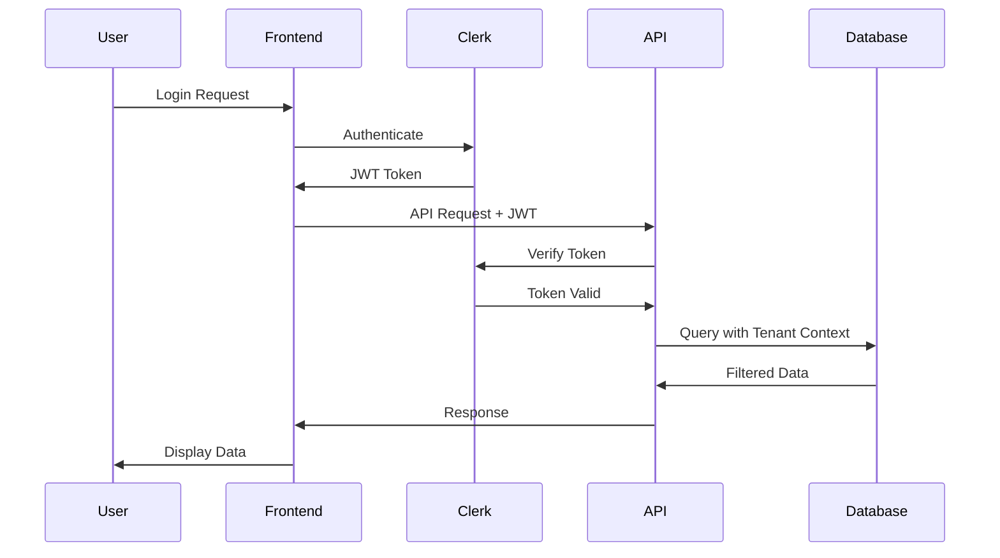

# Security & Authentication Guide

## 🔐 Security Overview

The OneClass Platform implements a comprehensive security architecture based on zero-trust principles, ensuring that every request is authenticated, authorized, and audited. This guide covers all security aspects of the platform.

## 🛡️ Security Architecture

### Zero Trust Principles
1. **Never Trust, Always Verify**: Every request must be authenticated
2. **Least Privilege Access**: Users get minimal necessary permissions
3. **Assume Breach**: Design systems to limit damage from compromises
4. **Verify Explicitly**: Use all available data points for decisions

### Security Layers
```
┌─────────────────────────────────────────────┐
│                 CDN Layer                   │
│        (DDoS Protection, WAF)               │
├─────────────────────────────────────────────┤
│              Load Balancer                  │
│        (SSL/TLS Termination)                │
├─────────────────────────────────────────────┤
│            Application Layer                │
│   (Authentication, Authorization, RBAC)     │
├─────────────────────────────────────────────┤
│             Database Layer                  │
│        (RLS, Encryption at Rest)            │
├─────────────────────────────────────────────┤
│           Infrastructure Layer              │
│     (Network Security, Monitoring)          │
└─────────────────────────────────────────────┘
```

## 🔑 Authentication System

### Multi-Tenant Authentication
The platform uses Clerk for authentication with custom multi-tenant routing:

```typescript
// Tenant-aware authentication
const { userId, sessionId } = auth();
const tenant = await getTenantFromSubdomain(request.headers.host);
const user = await getUserWithTenant(userId, tenant.id);
```

### Authentication Flow


### Supported Authentication Methods
1. **Email/Password**: Standard authentication
2. **SSO Integration**: SAML 2.0 and LDAP
3. **Multi-Factor Authentication**: TOTP, SMS, Email
4. **Social Login**: Google, Microsoft (configurable)
5. **Mobile Authentication**: Device-based authentication

## 🏢 Multi-Tenant Security

### Tenant Isolation
Each school operates in complete isolation with multiple security layers:

#### 1. Domain-Level Isolation
```typescript
// Middleware for tenant resolution
export async function tenantMiddleware(request: NextRequest) {
    const hostname = request.headers.get('host');
    const subdomain = extractSubdomain(hostname);
    const tenant = await getTenantBySubdomain(subdomain);
    
    if (!tenant) {
        return new Response('Tenant not found', { status: 404 });
    }
    
    // Inject tenant context
    request.headers.set('X-Tenant-ID', tenant.id);
}
```

#### 2. Database-Level Isolation
```sql
-- Row Level Security (RLS) policies
CREATE POLICY tenant_isolation_policy ON students
    FOR ALL USING (school_id = current_setting('app.current_school_id')::UUID);

-- Prevent cross-tenant data access
CREATE OR REPLACE FUNCTION set_tenant_context(p_school_id UUID)
RETURNS void AS $$
BEGIN
    PERFORM set_config('app.current_school_id', p_school_id::text, false);
END;
$$ LANGUAGE plpgsql;
```

#### 3. Application-Level Isolation
```python
# Tenant context decorator
def require_tenant_context(f):
    @wraps(f)
    async def decorated_function(*args, **kwargs):
        request = args[0]  # FastAPI request object
        tenant_id = request.headers.get('X-Tenant-ID')
        
        if not tenant_id:
            raise HTTPException(status_code=403, detail="Tenant context required")
        
        # Set database context
        await set_tenant_context(tenant_id)
        return await f(*args, **kwargs)
    
    return decorated_function
```

## 👥 Role-Based Access Control (RBAC)

### Role Hierarchy
```python
class Role(str, Enum):
    SUPER_ADMIN = "super_admin"      # Platform administration
    SCHOOL_ADMIN = "school_admin"    # School-wide management
    TEACHER = "teacher"              # Class-level access
    STUDENT = "student"              # Individual student access
    PARENT = "parent"                # Child-specific access
    STAFF = "staff"                  # Department-level access
    VIEWER = "viewer"                # Read-only access
```

### Permission Matrix
```python
PERMISSIONS = {
    "super_admin": ["*"],  # All permissions
    "school_admin": [
        "school.manage",
        "users.manage",
        "students.manage",
        "teachers.manage",
        "reports.view",
        "analytics.view"
    ],
    "teacher": [
        "classes.manage",
        "students.view",
        "grades.manage",
        "attendance.manage",
        "reports.view"
    ],
    "student": [
        "profile.view",
        "profile.update",
        "grades.view",
        "attendance.view",
        "assignments.view"
    ],
    "parent": [
        "child.view",
        "grades.view",
        "attendance.view",
        "fees.view",
        "communication.view"
    ],
    "staff": [
        "department.manage",
        "reports.view",
        "students.view"
    ]
}
```

### Permission Checking
```python
async def check_permission(user: User, permission: str, resource: str = None) -> bool:
    """Check if user has specific permission"""
    
    # Super admin has all permissions
    if user.role == Role.SUPER_ADMIN:
        return True
    
    # Get user permissions
    user_permissions = PERMISSIONS.get(user.role, [])
    
    # Check exact permission
    if permission in user_permissions:
        return True
    
    # Check wildcard permissions
    for perm in user_permissions:
        if perm.endswith('.*') and permission.startswith(perm[:-2]):
            return True
    
    # Check resource-specific permissions
    if resource:
        resource_permission = f"{permission}.{resource}"
        if resource_permission in user_permissions:
            return True
    
    return False
```

## 🔒 Data Protection

### Encryption at Rest
```python
from cryptography.fernet import Fernet

class DataEncryption:
    def __init__(self, key: str):
        self.fernet = Fernet(key.encode())
    
    def encrypt_sensitive_data(self, data: str) -> str:
        """Encrypt sensitive data before storing"""
        return self.fernet.encrypt(data.encode()).decode()
    
    def decrypt_sensitive_data(self, encrypted_data: str) -> str:
        """Decrypt sensitive data after retrieval"""
        return self.fernet.decrypt(encrypted_data.encode()).decode()
```

### PII Protection
```python
class PIIProtection:
    @staticmethod
    def mask_email(email: str) -> str:
        """Mask email for logging"""
        username, domain = email.split('@')
        masked_username = username[:2] + '*' * (len(username) - 2)
        return f"{masked_username}@{domain}"
    
    @staticmethod
    def mask_phone(phone: str) -> str:
        """Mask phone number for logging"""
        return phone[:3] + '*' * (len(phone) - 6) + phone[-3:]
```

### Data Anonymization
```python
class DataAnonymization:
    @staticmethod
    def anonymize_student_data(student_data: dict) -> dict:
        """Anonymize student data for analytics"""
        return {
            'id': student_data['id'],
            'grade': student_data['grade'],
            'age_group': calculate_age_group(student_data['date_of_birth']),
            'performance_metrics': student_data['performance_metrics']
        }
```

## 🔍 Security Monitoring

### Audit Logging
```python
class AuditLogger:
    async def log_security_event(
        self,
        event_type: str,
        user_id: str,
        resource: str,
        action: str,
        result: str,
        ip_address: str,
        user_agent: str
    ):
        """Log security events for audit trail"""
        
        audit_entry = {
            'timestamp': datetime.utcnow(),
            'event_type': event_type,
            'user_id': user_id,
            'resource': resource,
            'action': action,
            'result': result,
            'ip_address': ip_address,
            'user_agent': user_agent,
            'tenant_id': get_current_tenant_id()
        }
        
        # Store in database
        await self.store_audit_entry(audit_entry)
        
        # Send to monitoring system
        await self.send_to_monitoring(audit_entry)
```

### Threat Detection
```python
class ThreatDetection:
    async def detect_brute_force(self, ip_address: str, user_id: str) -> bool:
        """Detect brute force attacks"""
        
        # Check failed login attempts
        failed_attempts = await self.get_failed_attempts(ip_address, user_id)
        
        if failed_attempts >= 5:
            await self.create_security_alert(
                'brute_force_attack',
                ip_address,
                user_id
            )
            return True
        
        return False
    
    async def detect_unusual_access(self, user_id: str, ip_address: str) -> bool:
        """Detect unusual access patterns"""
        
        # Check for access from new locations
        known_locations = await self.get_user_locations(user_id)
        current_location = await self.get_ip_location(ip_address)
        
        if current_location not in known_locations:
            await self.create_security_alert(
                'unusual_access_location',
                ip_address,
                user_id
            )
            return True
        
        return False
```

## 🛡️ API Security

### Rate Limiting
```python
from slowapi import Limiter
from slowapi.util import get_remote_address

limiter = Limiter(key_func=get_remote_address)

@app.post("/api/v1/auth/login")
@limiter.limit("5/minute")
async def login(request: Request, credentials: LoginCredentials):
    """Login endpoint with rate limiting"""
    return await authenticate_user(credentials)
```

### Input Validation
```python
from pydantic import BaseModel, validator
import re

class StudentCreate(BaseModel):
    first_name: str
    last_name: str
    email: str
    phone: Optional[str] = None
    
    @validator('email')
    def validate_email(cls, v):
        if not re.match(r'^[a-zA-Z0-9._%+-]+@[a-zA-Z0-9.-]+\.[a-zA-Z]{2,}$', v):
            raise ValueError('Invalid email format')
        return v
    
    @validator('phone')
    def validate_phone(cls, v):
        if v and not re.match(r'^\+?[\d\s-()]{10,}$', v):
            raise ValueError('Invalid phone format')
        return v
```

### SQL Injection Prevention
```python
# Use parameterized queries
async def get_student_by_id(student_id: str) -> Student:
    query = """
    SELECT * FROM students 
    WHERE id = $1 AND school_id = current_setting('app.current_school_id')::UUID
    """
    
    result = await database.fetch_one(query, [student_id])
    return Student(**result) if result else None
```

## 🔐 SSO Integration

### SAML 2.0 Implementation
```python
from saml2 import BINDING_HTTP_POST, BINDING_HTTP_REDIRECT
from saml2.config import Config as Saml2Config

class SAMLHandler:
    def __init__(self, school_id: str):
        self.school_id = school_id
        self.config = self.get_saml_config()
    
    def get_saml_config(self) -> dict:
        return {
            'entityid': f'https://{self.school_subdomain}.oneclass.ac.zw',
            'assertion_consumer_service': [
                {
                    'url': f'https://{self.school_subdomain}.oneclass.ac.zw/auth/saml/acs',
                    'binding': BINDING_HTTP_POST,
                }
            ],
            'single_logout_service': [
                {
                    'url': f'https://{self.school_subdomain}.oneclass.ac.zw/auth/saml/sls',
                    'binding': BINDING_HTTP_REDIRECT,
                }
            ],
            'idp': {
                'sso_url': school_config.saml_sso_url,
                'slo_url': school_config.saml_slo_url,
                'x509cert': school_config.saml_certificate,
            }
        }
    
    async def initiate_login(self) -> str:
        """Initiate SAML login"""
        auth_url = self.client.login()
        return auth_url
    
    async def process_response(self, saml_response: str) -> User:
        """Process SAML response and create/update user"""
        attributes = self.client.parse_response(saml_response)
        
        user_data = {
            'email': attributes.get('email'),
            'first_name': attributes.get('first_name'),
            'last_name': attributes.get('last_name'),
            'role': attributes.get('role', 'student'),
            'school_id': self.school_id
        }
        
        return await self.create_or_update_user(user_data)
```

### LDAP Integration
```python
import ldap3

class LDAPHandler:
    def __init__(self, school_config: dict):
        self.server = ldap3.Server(school_config['ldap_server'])
        self.base_dn = school_config['ldap_base_dn']
        self.bind_dn = school_config['ldap_bind_dn']
        self.bind_password = school_config['ldap_bind_password']
    
    async def authenticate_user(self, username: str, password: str) -> Optional[User]:
        """Authenticate user against LDAP"""
        
        try:
            # Bind to LDAP server
            conn = ldap3.Connection(
                self.server,
                user=self.bind_dn,
                password=self.bind_password
            )
            
            if not conn.bind():
                return None
            
            # Search for user
            search_filter = f"(uid={username})"
            conn.search(self.base_dn, search_filter)
            
            if not conn.entries:
                return None
            
            user_entry = conn.entries[0]
            
            # Try to bind as user
            user_conn = ldap3.Connection(
                self.server,
                user=user_entry.entry_dn,
                password=password
            )
            
            if user_conn.bind():
                return await self.create_user_from_ldap(user_entry)
            
            return None
            
        except Exception as e:
            logger.error(f"LDAP authentication error: {e}")
            return None
```

## 📱 Mobile Security

### Device Registration
```python
class MobileDeviceManager:
    async def register_device(
        self,
        user_id: str,
        device_id: str,
        device_info: dict
    ) -> DeviceRegistration:
        """Register mobile device for user"""
        
        # Generate device token
        device_token = secrets.token_urlsafe(32)
        
        # Store device registration
        registration = DeviceRegistration(
            user_id=user_id,
            device_id=device_id,
            device_token=device_token,
            device_name=device_info.get('name'),
            device_type=device_info.get('type'),
            device_os=device_info.get('os'),
            is_trusted=False,
            created_at=datetime.utcnow()
        )
        
        await self.store_device_registration(registration)
        
        return registration
    
    async def verify_device(self, device_token: str) -> Optional[DeviceRegistration]:
        """Verify device token"""
        return await self.get_device_by_token(device_token)
```

### Mobile API Security
```python
class MobileAPIAuth:
    async def authenticate_mobile_request(
        self,
        request: Request
    ) -> Optional[User]:
        """Authenticate mobile API request"""
        
        # Check for device token
        device_token = request.headers.get('X-Device-Token')
        if not device_token:
            return None
        
        # Verify device registration
        device = await self.verify_device(device_token)
        if not device:
            return None
        
        # Check JWT token
        auth_header = request.headers.get('Authorization')
        if not auth_header or not auth_header.startswith('Bearer '):
            return None
        
        token = auth_header.split(' ')[1]
        user = await self.verify_jwt_token(token)
        
        # Ensure user owns device
        if user and user.id == device.user_id:
            return user
        
        return None
```

## 🔧 Security Configuration

### Environment Variables
```bash
# Encryption keys
SECRET_KEY=your-super-secret-key-here
DATABASE_ENCRYPTION_KEY=your-database-encryption-key

# JWT Configuration
JWT_SECRET_KEY=your-jwt-secret-key
JWT_ALGORITHM=HS256
JWT_EXPIRATION_HOURS=24

# Clerk Configuration
CLERK_SECRET_KEY=sk_test_your_clerk_secret_key
NEXT_PUBLIC_CLERK_PUBLISHABLE_KEY=pk_test_your_clerk_publishable_key

# CORS Configuration
CORS_ORIGINS=["https://oneclass.ac.zw", "https://*.oneclass.ac.zw"]
CORS_ALLOW_CREDENTIALS=true

# Rate Limiting
RATE_LIMIT_REQUESTS_PER_MINUTE=60
RATE_LIMIT_REQUESTS_PER_HOUR=1000

# Session Configuration
SESSION_TIMEOUT_MINUTES=30
SESSION_CLEANUP_INTERVAL_HOURS=24
```

### Security Headers
```python
from fastapi.middleware.cors import CORSMiddleware
from fastapi.middleware.trustedhost import TrustedHostMiddleware

app.add_middleware(
    CORSMiddleware,
    allow_origins=["https://oneclass.ac.zw", "https://*.oneclass.ac.zw"],
    allow_credentials=True,
    allow_methods=["GET", "POST", "PUT", "DELETE"],
    allow_headers=["*"],
)

app.add_middleware(
    TrustedHostMiddleware,
    allowed_hosts=["oneclass.ac.zw", "*.oneclass.ac.zw"]
)

# Security headers middleware
@app.middleware("http")
async def add_security_headers(request: Request, call_next):
    response = await call_next(request)
    
    response.headers["X-Content-Type-Options"] = "nosniff"
    response.headers["X-Frame-Options"] = "DENY"
    response.headers["X-XSS-Protection"] = "1; mode=block"
    response.headers["Strict-Transport-Security"] = "max-age=31536000; includeSubDomains"
    response.headers["Referrer-Policy"] = "strict-origin-when-cross-origin"
    
    return response
```

## 🔍 Security Testing

### Penetration Testing Checklist
- [ ] SQL Injection testing
- [ ] Cross-Site Scripting (XSS) testing
- [ ] Cross-Site Request Forgery (CSRF) testing
- [ ] Authentication bypass testing
- [ ] Authorization testing
- [ ] Session management testing
- [ ] Input validation testing
- [ ] Error handling testing

### Security Scanning Tools
```bash
# OWASP ZAP
zap-cli quick-scan --self-contained http://localhost:3000

# Bandit (Python security linter)
bandit -r backend/

# ESLint security plugin
npm audit
eslint --ext .js,.ts frontend/
```

## 📋 Compliance

### GDPR Compliance
- **Data Minimization**: Collect only necessary data
- **Purpose Limitation**: Use data only for stated purposes
- **Data Retention**: Automatic deletion after retention period
- **Right to Erasure**: User can request data deletion
- **Data Portability**: Export user data in standard format
- **Privacy by Design**: Built-in privacy protection

### SOC 2 Compliance
- **Security**: Logical and physical access controls
- **Availability**: System availability and performance
- **Processing Integrity**: System processing accuracy
- **Confidentiality**: Information protection
- **Privacy**: Personal information protection

## 📞 Security Incident Response

### Incident Response Plan
1. **Detection**: Automated monitoring and alerting
2. **Analysis**: Security team investigation
3. **Containment**: Isolate affected systems
4. **Eradication**: Remove threat from environment
5. **Recovery**: Restore normal operations
6. **Lessons Learned**: Post-incident review

### Emergency Contacts
- **Security Team**: security@oneclass.ac.zw
- **On-Call Engineer**: +263-XXX-XXXX
- **Legal Team**: legal@oneclass.ac.zw

---

**Last Updated**: 2024-01-18
**Version**: 1.0.0
**Next Review**: 2024-04-18
**Compliance**: GDPR, SOC 2 Ready